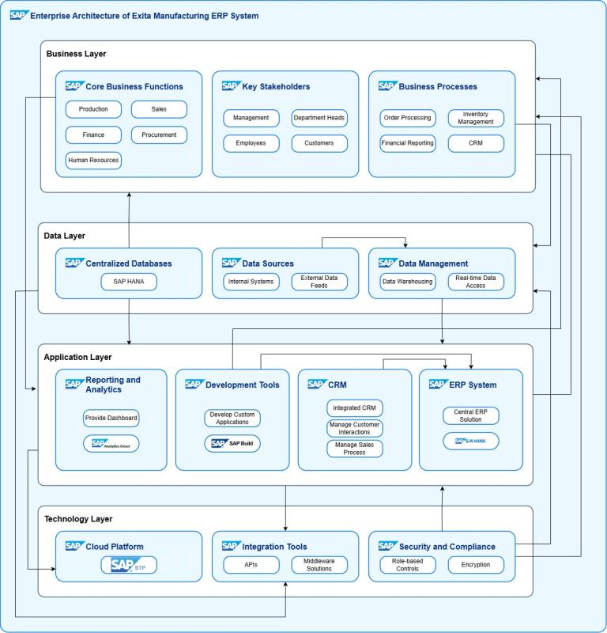
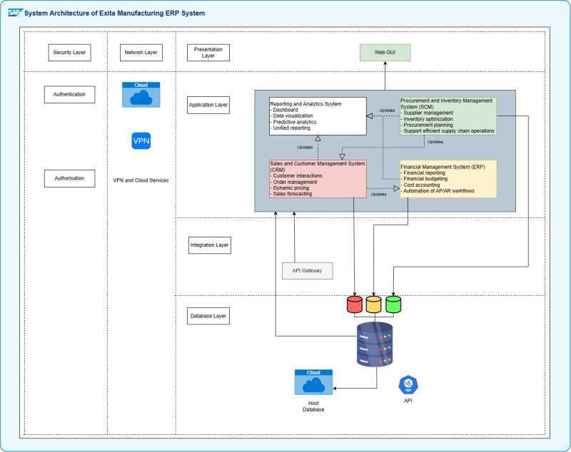
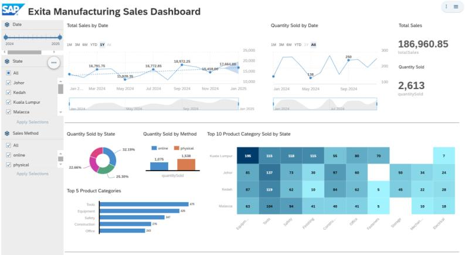

# 🚀 Exita Manufacturing ERP System

A centralized ERP solution for enhancing operations, visibility, and scalability using the SAP Cloud Platform.

## 📘 Introduction

Exita Manufacturing is a mid-sized company specializing in industrial equipment production. The company faced major challenges due to fragmented systems across departments, leading to:

- ❌ Operational inefficiencies  
- ❌ Poor inter-departmental collaboration  
- ❌ Limited decision-making capabilities  
- ❌ Scalability issues for future growth  

To address these issues, this project introduces a centralized **Enterprise Resource Planning (ERP)** system built on the **SAP Cloud Platform**.

---

## ✅ Key Modules Implemented

- **📊 Reporting and Analytics** – Real-time dashboards, KPI tracking, and predictive insights  
- **🛒 Sales and Customer Management (CRM)** – Customer profiles, order tracking, sales forecasting  
- **📦 Procurement and Inventory Management (SCM)** – Real-time inventory, supplier tracking, demand planning  
- **💰 Financial Management** – Automated AP/AR, budgeting, financial reporting, compliance tools  

---

## 🎯 Project Objectives

- Centralize business operations for consistency and efficiency  
- Automate repetitive tasks to reduce manual workload  
- Enable real-time access to unified data for better decision-making  
- Improve scalability using SAP's cloud-based architecture  

---

## 🧱 Methodologies Used

- **TOGAF** – For enterprise architecture alignment  
- **Waterfall (SDLC)** – For structured design, development, and testing  

---

## 🌟 Project Benefits

- ⚡ Faster and more accurate business operations  
- 🤝 Improved cross-department collaboration  
- 📈 Data-driven strategic planning  
- 🌍 Scalable infrastructure for future expansion  
- 🛡️ Enhanced security and compliance  

---

## 🏗️ System Architecture

### 🧩 Enterprise Architecture of Exita Manufacturing ERP System

> 📄 *For detailed architecture layers and explanation, please refer to the project document.*

---

### 🖥️ System Architecture of Exita Manufacturing ERP System

> 📄 *For system components and integration overview, see the document.*

---

## 📊 Exita Manufacturing Sales Dashboard

> 📄 *Refer to the document for interactive features, filters, and full dashboard UI.*

---

## 📁 Full Documentation

For complete use case descriptions, diagrams, implementation phases, and testing results:  
➡️ **Refer to** `ESDM Project Report - Group4 Crafters.pdf`
